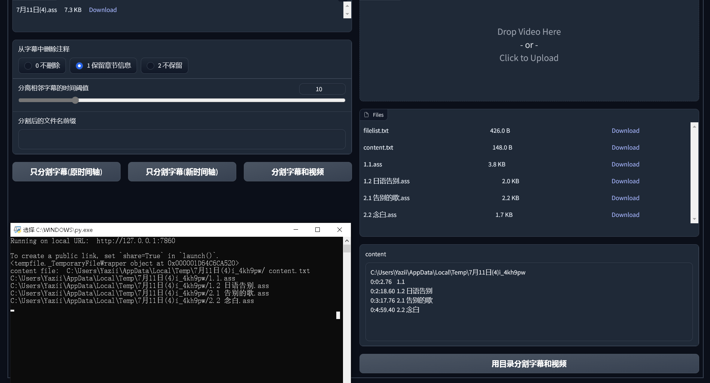

# Video Shuffler | 洋片箱
Cut video to clips and shuffle them by ass file.  
用ass格式的字幕文件切割视频，并重组输出。

## 缘起
2022年9月，我在做Tacotron2的语音合成模型的训练。  
在准备数据集的时候，做了一个简单的用ass字幕切割音频文件的工具。  
工作流程非常顺畅，可以通过调整字幕时间控制剪辑位置，可以删除字幕取消一条内容，可以合并多行字幕来合并音频文件。 
后来我想，如果用这个基础上切割视频并重新排序，是不是就可以方便的剪辑二刀流或者三剪一视频了呢？  
但是一直没有动手。 

然后我在11月看到李沐老师的[AutoCut](https://github.com/mli/autocut/)，我们理念相近但是又不完全相合。
因此开始自己制作工具。 

在制作的过程中，又逐步改变了想法，放弃了Autocut项目使用markdown文件的做法。

洋片箱的命名来自游戏恋爱绮谭，一种现实有原型的怪异，只要更改照片的顺序就能够改变事实。

## 为什么使用字幕驱动剪辑
多数三剪一和二刀流主要是以人物说了什么内容而驱动的。

## 为什么在非编软件外操作
有没有在说话，可以通过波形图查看；说的内容，可以通过字幕查看。似乎目前的非编软件是提供了操作界面，但是还是不够快捷。
并不能很好标注我在剪辑的这几个片段到底是什么内容。

我所推崇的字幕编辑工具Aegisub能够更好地调整字幕；而洋片箱输出的结果，已经裁剪掉了大量无用内容；并且输出的文件名包含了章节信息，导入非编软件之后也能清楚地分辨

最后，对业余视频剪辑来说，存储和搜索视频素材是很困难的；但是文本搜索就简单很多了。如果每个视频都保留了字幕文件（如果保留了音频那就更好了），而本地硬盘中并没有保留视频本身，那么在制作视频前，无需下载原视频文件就可以开工——搜索字幕中需要的片段，编辑并保存字幕副本，当视频下载回来的时候就可以直接进一步剪辑了。

## 特性对比
||传统视频切分工具|传统非编软件|AutoCut|(Video Shuffler)洋片箱|
|---|---|---|---|---|
|自动删除无语音区域|x|x|v|v|
|快速删除指定时长的内容|x|快捷性存疑|x|v 插入注释即产生截断效果，调整有效内容时长即可|
|快速恢复某一句被删减的内容|x|x|v|v|
|导出速度|快|快|慢（受限于pymovie）|慢（受限于pymovie）|
|分段导出|v|x|x|v|
|在工程中指定每一段的名称|x|x|x|v|
|只导出音频（从而提高速度）|x|x|x|v|
|非线性编辑（打乱时序）|x|v|x|v 使用文本编辑器调整行的顺序|
|图形化编辑|v|v|x|v|
|快速预览某句话的实际内容|x 无法搜索|x 搜索困难|x 无法预览|v 借助Aegisub实现搜索和预览|
|预览时产生卡顿(音画不同步）|x|v|无预览功能|x|
|导出分离的字幕和视频|x|x 需要隐藏字幕层后单独导出|x 无法导出字幕|v|
|工程体积|小|大|小|小|
|版本管理|x|困难|可使用文件名或git实现版本管理|可使用文件名或git实现版本管理|


## 计划抄什么
虽然看上去有点缝合怪，但是就要都做进去。
- [x] 使用ass字幕切割视频为多个片段，同时输出切分的字幕和切分章节文件名列表（txt文件）
- [x] 使用txt文件控制，合并多个视频和字幕为一个，同时输出合并字幕
- [x] 在兼容ass格式的基础上，对字幕的信息做扩展
- [x] 使用gradio制作UI
- [ ] 自动识别字幕中每句分别属于哪个角色（目前试过的几个开源项目效果都还不够实用）
- [ ] 快速切换字幕中是否包含“xxx:”
- [x] lrc和字幕的转换
- [ ] 音频格式转换
- [ ] 对录播弹幕浓度进行计算，和录音字幕合并输出到csv文件，通过excel色阶工具快速发现整场直播的热点时刻主播说了什么（可惜不能整合到Aegisub中）

## 安装
安装依赖模块 gradio 和 moviepy
```
pip install gradio
pip install moviepy

```

安装 [ffmpeg](https://ffmpeg.org/)
（注意Windows用户需要把ffmpeg添加到环境变量中）

## 使用
有3种使用方式：

1. 在Aegisub中添加[脚本](https://github.com/tumuyan/video-shuffler-for-aegisub)，在Aegisub的GUI中进行操作

2. 点击app.py，根据弹出的提示，在浏览器中输入类似 http://127.0.0.1:8090 的地址


3. 在命令行中输入类似`python main.py 其他参数`  

    示例0：分离字幕为多个片段（使用原视频的时间轴，使用原视频+新字幕检查字幕片段是否正确）  
    `python main.py xxx.ass -rt`等同`python main.py xxx.ass -m cut -c 1 -t 10 -rt `  

    示例1：分离字幕为多个片段（使用新的时间轴，简单检查字幕片段是否正确，实际意义不大）  
    `python main.py xxx.ass`等同`python main.py xxx.ass -m cut -c 1 -t 10 `  

    示例2： 切分章节列表文件中的片段的视频和字幕,其中视频只处理音频（从而加快速度）  
    `python main.py xxx.ass -i "xxx.mp4" -a -r "xxxx content.txt"`  

    示例3: 切分章节列表文件中的片段的视频和字幕  
    `python main.py xxx.ass -i "xxx.mp4" -v -r "xxxx content.txt"`  

    示例4: 切分视频和字幕为多个片段  
    `python main.py xxx.ass -i "xxx.mp4" -v`  

    示例5: 转换字幕列表文件中的字幕为lrc文件  
    `python main.py xxx.ass -m lrc`  
    `python main.py "xxxx  filelist.txt" -m lrc`  

    示例6：合并视频和字幕文件  
    `python main.py "xxxx  filelist.txt" -v -m merge`   

完整参数列表：

```
usage: main.py [-h] [-m {cut,merge,mergelrc,lrc}] [-n NAME] [-r REF_CONTENT] [-i INPUT_VIDEO]
               [-v | --cut-video | --no-cut-video] [-a | --cut-audio | --no-cut-audio] [-c {0,1,2}]
               [-b | --skip-blank-chapter-name | --no-skip-blank-chapter-name] [-t TIME_THRESHOLD]
               [-rt | --raw-time | --no-raw-time] [-f {.mp4,.mkv,.mp3,.wav,.aac}]
               input

Cut video to clips and shuffle them by ass file

positional arguments:
  input                 Input file path (ass format)

optional arguments:
  -h, --help            show this help message and exit
  -m {cut,merge,mergelrc,lrc}, --mode {cut,merge,mergelrc,lrc}
                        mode
  -n NAME, --name NAME  prefix for output files
  -r REF_CONTENT, --ref-content REF_CONTENT
                        ref content file or str
  -i INPUT_VIDEO, --input-video INPUT_VIDEO
                        Input video path
  -v, --cut-video, --no-cut-video
                        output videos
  -a, --cut-audio, --no-cut-audio
                        output audio ( --cut-audio will override --cut-video )
  -c {0,1,2}, --remove-comment {0,1,2}
                        Level of remove comment
  -b, --skip-blank-chapter-name, --no-skip-blank-chapter-name
                        Not output chapters without chapter name
  -t TIME_THRESHOLD, --time-threshold TIME_THRESHOLD
                        time threshold for ass
  -rt, --raw-time, --no-raw-time
                        output ass file with raw time
  -f {.mp4,.mkv,.mp3,.wav,.aac}, --format {.mp4,.mkv,.mp3,.wav,.aac}
                        format of output media file

```

## 工作流说明
1. 使用剪映对视频进行语音识别，并导出src字幕
2. 使用Aegisub对字幕内容进行速览和矫正
3. 在Aegisub中找到重点关注的内容并进行标注和调整；对非关注的内容快速删除，或者把字幕类型改为注释
4. 使用洋片箱对字幕使用原时间轴模式进行切分
5. 检查切分结果，是否有标注错误，并修改context，只保留本次需要使用的章节
6. 使用洋片箱，把context文件作为ref context参数，对字幕和视频进行切分
8. 把切分结果按照需要的顺序拖入剪映或者其他软件

* 特别的，如果制作3-1，需要把同文件的后方某个位置的视频片段移动到前方，只需要直接使用文本编辑器把字幕剪切到前方即可；AegiSub可以按照修改后的时序进行预览；而洋片箱针对时隙大于阈值（time_threshold）的片段进行自动剪切。
* 如果使用洋片箱对视频进行分段（但是不抛弃任何部分），可以插入章节注释，并把章节注释前后的时间戳改为相同的值
* 在Aegisub中，可以使用Ctrl+X和Ctrl+V对字幕内容的顺序进行调整。

## 对ASS字幕格式的利用和扩充

ASS字幕格式的主体内容的部分在Event字段
```
[Events]
Format: Layer, Start, End, Style, Name, MarginL, MarginR, MarginV, Effect, Text
Comment: 0,0:00:00.00,0:00:00.00,Default,,0,0,0,,# 开场白
Dialogue: 0,0:00:02.76,0:00:03.56,Default,,0,0,0,,米娜桑
Comment: 0,0:00:04.06,0:00:07.16,Default,,0,0,0,,本当に申し訳ない
```

目前主要在利用Format和Text部分的内容。Text，即字幕显示或者注释的主体文本。Format有两种值：
- Dialogue，即普通字幕。
- Comment，即注释。在播放视频时，注释的行的内容不会显示；在导入剪映时，注释的行会被自动删除。在洋片箱中，Comment有两种用法：
  1. 把此行字幕标记为完全不需要的内容。其结果是，输出视频时，会跳过这段视频内容。但是因为Aegisub的字幕排序方式并没有format排序，所以为方便查看，最好同时使用layer标注并进行排序。
  2. 用来标记章节信息。（此时Text的内容需要以`# `或`## `开头）其结果是，视频从此位置被截断，前后分别输出到不同文件中，并且文件名按照章节编号和内容进行命名。
  
* 个人习惯：如果不便在洋片箱中进行处理的位置（比如不准备裁剪画面，但是需要处理音频），可以在字幕前方或者后方添加`---`，导入非编软件后再根据字幕内容对这个位置进行手工修剪。

## 目前存在的问题
1. 没有处理字幕时间的问题。如果存在字幕的时间有重叠，可能有问题。
2. 虽然在解析字幕时做了一定的通用化处理，但是仍然只能保证完全视频Aegisub导出的ASS格式字幕。
3. 程序没有对特殊字符做处理，因此路径和章节名称不可使用特殊字符（比如`:`）
4. pymovie有严重的效率问题，如果有复杂编辑，强烈建议对长视频文件进行切割；如需预览使用导出音频的方式预览
